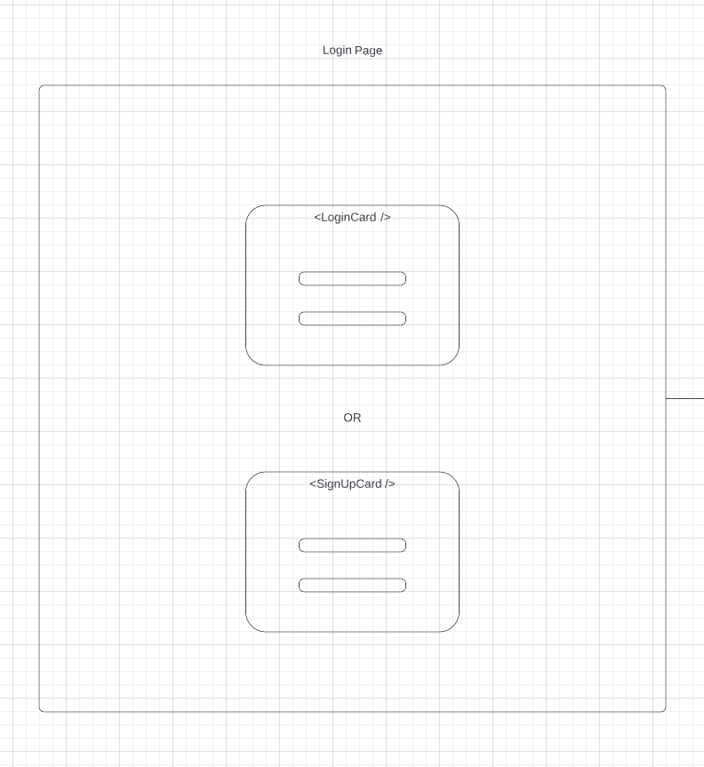

# NBA Fantasy Draft

## Introduction

This application is an NBA Fantasy Mock Draft clone. Functionality includes creating a user account, creating or joining a mock draft, setting up a draft scoring system, and drafting players to your mock Fantasy Team! This application uses a 3rd Party API (balldontlie API) to fetch NBA player data. The draft scoring system that the user sets up for a mock draft is used in conjunction with the NBA player data to calculate a projected fantasy score for the upcoming 2022 NBA season. Your fantasy team's projected total score is continuously updated with each player selected, and you can compare total team scores with your friends because multiple users can join and draft together!

App Link: https://nba-fantasy-draft-et.herokuapp.com/

### Technologies Used

    Front End: React.js, JavaScript, HTML, CSS, React-Bootstrap

    Back End: Express.js, Node.js, MongoDB, Mongoose

    3rd Party API: balldontlie (https://www.balldontlie.io/)

    Additional Tech: socket.io (Web Sockets), JavaScript Web Tokens (JWT)

## Planning Material

An entity relationship diagram (ERD), wireframes, and a Trello board used as planning material for this application are shown below.

### Entity Relationship Diagram
https://lucid.app/lucidchart/fe8fbce1-1ed3-4c3c-8a6b-a7b14c615739/edit?viewport_loc=192%2C25%2C1579%2C835%2C0_0&invitationId=inv_87e5d2f6-cf38-41d4-8a7d-d8332d1c8fdb#
 

### Wireframes
https://lucid.app/lucidchart/fe8fbce1-1ed3-4c3c-8a6b-a7b14c615739/edit?viewport_loc=-43%2C36%2C5046%2C2668%2C1reFkgoDHowA&invitationId=inv_87e5d2f6-cf38-41d4-8a7d-d8332d1c8fdb#
 

### Trello
https://trello.com/b/lcM3GnQp/project-4-nba-fantasy-draft
 

## Unsolved Problems
### Ball Dont Lie 429 Error

The 3rd party API (balldontlie) throws a 429 error when too many API calls are sent. The API requires at least 2 API calls per player to retrieve the full set of basketball statistics and name data. However, the API is limited to 60 requests per minute. To limit the number of API calls made, I've implemented memoization of player data to a React component state variable and I've limited loading player data to only 5 players at a time. However, this does not guarantee the avoidance of reaching the rate limit and receiving the 429 error.

### Draft Page Available Player Loading Screen

 
A loading screen is applied to the PlayerList React component every time the list of remaining available players is changed. Currently, a setTimeout of 2 seconds is used to allow time for player data to load in from API calls. We are currently working on modifying this timeout to become dynamic based on the actual time taken for API data to come in.

## Future Enhancements

<ul>
    <li>Player search bar on DraftPage component</li>
    <li>Messaging system within the DraftPage component</li>
    <li>Add a timer for users to draft a player</li>
    <li>Add NBA Player images</li>
    <li>Add a way to view other user's drafted teams (including a summary card)</li>
</ul>